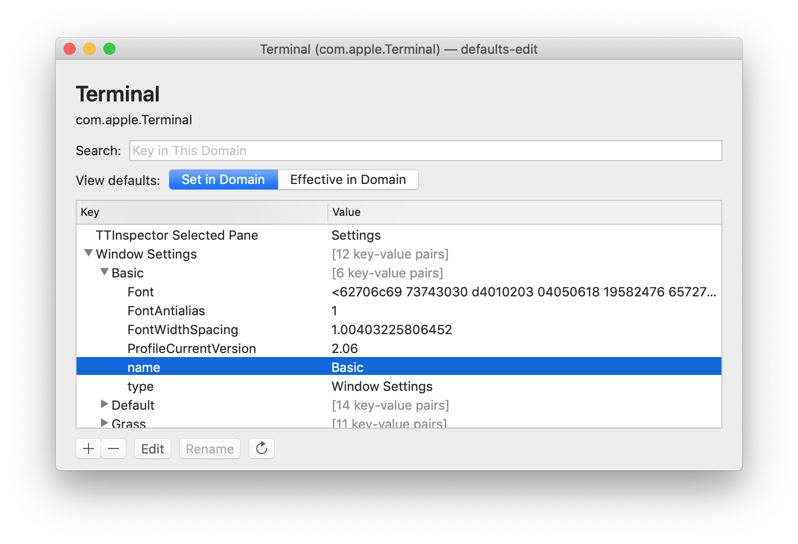
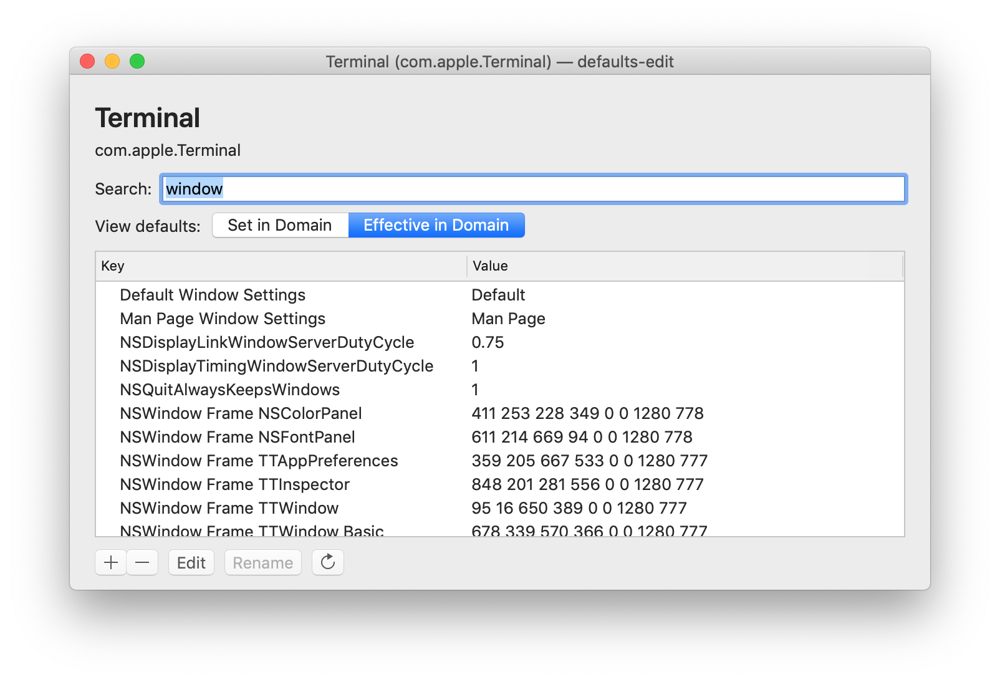
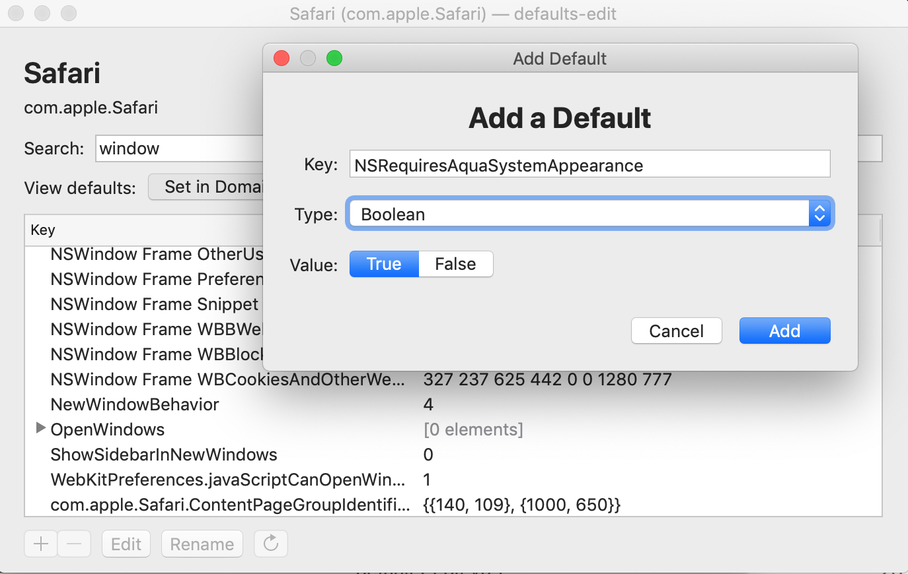
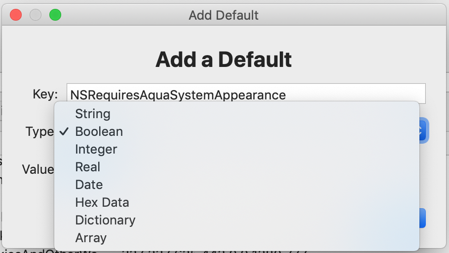

# defaults-edit
A graphical user defaults editor for macOS.

## Get it
View [releases on GitHub](https://github.com/ThatsJustCheesy/defaults-edit/releases). Each includes a zip file with a prebuilt binary. Simply drag it to /Applications to install.

## Features
- Easily browse and search available domains
- Browse defaults in any domain, including contents of arrays and dictionaries
- Filter visible keys within domains
- Add and edit defaults with any primitive property list type:
  - String
  - Boolean
  - Integer
  - Real (float)
  - Date
  - Hex data
- Optionally, view all the defaults currently effective in a domain, regardless of where they are set

### Screenshots

## Todos
- Ability to add arrays and dictionaries
- Ability to edit contents of arrays and dictionaries
- Implement Rename, which moves value to new key
- Duplicate, which copies value to new key
- Relaunch button when editing app defaults
- Integrate Sparkle.framework for updates (?)

## Bugs
- Selecting "Array" or "Dictionary" as a value's type currently crashes. This is simply unimplemented right now, but that should change.
